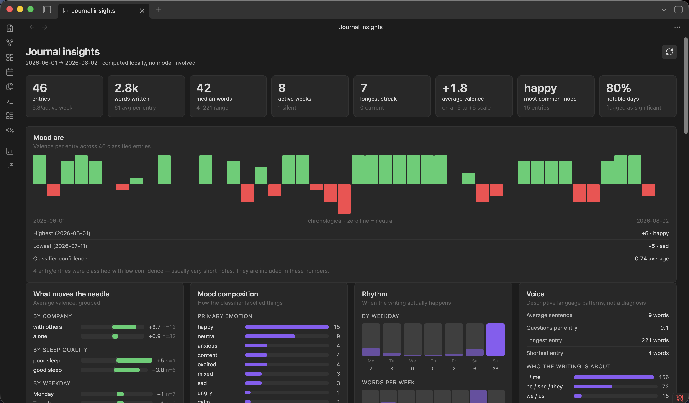
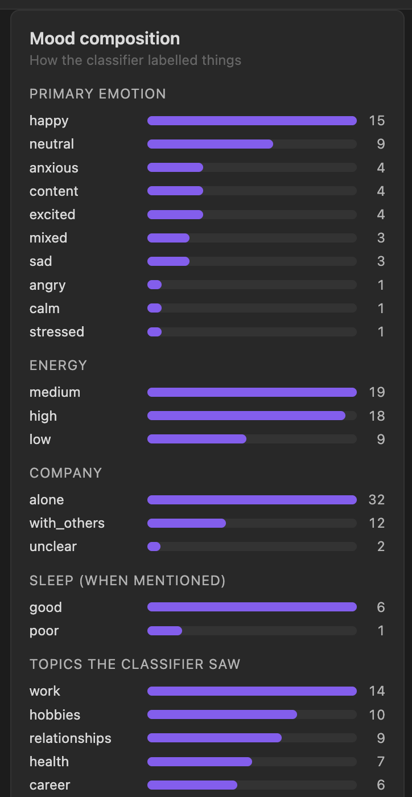

# Confidant (Obsidian plugin)

[](https://buymeacoffee.com/debayanbh)

<br clear="left">


## Why this exists

Writing a journal entry is easy. Going back and actually noticing something —
the mood that kept recurring, the thing you've been avoiding saying outright,
the week that quietly went better than you gave it credit for — is the part
almost nobody does, because it takes stepping back, and stepping back takes
time most of us don't spend on our own writing.

This plugin does that stepping-back for you. It reads what you've already
written and hands it back as a reflection: what shifted, what repeated, what's
sitting underneath the events themselves. Not therapy, not advice — closer to
having read your own week back to you with a bit more distance than you had
while living it.

## Philosophy: local-first, not local-only

Your journal is about as private as writing gets, so this was built local
first: point it at a model running on your own machine and nothing you've
written ever has to leave it. That's the default assumption behind every
design decision in this plugin.

But building *only* for that path would have shut out anyone without the
hardware or patience to run a good local model, and there are real moments
where a more capable cloud model is worth the tradeoff. So OpenRouter is in
there too — as an opt-in add-on you can reach for, never the thing you're
funneled into. Local stays the default philosophy; it was never meant to be a
wall.

## Features

- **Weekly, biweekly, monthly and yearly reflective summaries** — each tier
  builds on the one below it, so a yearly summary is reasoning over a year's
  worth of already-distilled thinking, not re-reading 365 days of raw entries.
- **13 reflection frameworks to choose from**, drawn from established
  psychological and philosophical traditions — CBT, ACT, internal family
  systems (parts work), psychodynamic & attachment, narrative therapy,
  self-determination theory, positive psychology, rumination & metacognition,
  behavioural science, existential, Stoic reflection, motivational
  interviewing, plus a general integrative default. Switch anytime, or write
  your own from scratch.
- **Voice and tone, fully in your control** — first, second or third person;
  your own name in the text; a directness slider from gentle to blunt; a
  length slider from a few sentences to an elaborate read.
- **Mood tracking**, extracted automatically per entry — emotion, valence,
  energy, sleep, company, topics — feeding both the written summaries and the
  dashboard below.
- **An insights dashboard that needs no model at all** — writing streaks and
  rhythm, mood trends sliced by context, your most-used words, the people and
  topics you write about most, and the entries that stand out. Plus one
  optional AI-written "portrait": a short reflective read of who you seem to
  be, grounded in your own measured numbers.
- **Memory that carries across summaries** — durable facts and past periods
  feed into every new one, so this month isn't read in a vacuum from last
  month.
- **Self-healing metadata** — entries missing the frontmatter the plugin needs
  get it filled in automatically before generating, so imperfect note-taking
  habits never block anything.
- **Point it at your whole vault or one folder**, filter by tag or don't —
  your call.
- **Any OpenAI-compatible backend** — OpenRouter or a local server (LM
  Studio, llama.cpp, Ollama, mlx-openai-server, or anything else that speaks
  the same API) — swappable anytime from settings.
- **Nothing runs without you asking it to.** Generate on demand from a ribbon
  button or the command palette; an optional interval check can remind you,
  but never generates unattended unless you explicitly turn that on.

## About

Hi, I'm Debayan — a software developer who just likes building things,
especially things I actually care about. Self-reflection is one of those
things, and this plugin is what came out of wanting a better way to do it
with journal entries I was already writing anyway.

If it's useful to you too, I'd appreciate a
[coffee](https://buymeacoffee.com/debayanbh) ☕.

## Install

Not yet listed in Community Plugins (pending submission). Until then:

**Manual install** — download `main.js`, `manifest.json` and `styles.css`
from the [latest release](../../releases/latest) into
`<vault>/.obsidian/plugins/confidant/`, then enable the plugin under
Settings → Community plugins.

**[BRAT](https://github.com/TfTHacker/obsidian42-brat)** — add this repo as a
beta plugin and BRAT handles install and updates for you.

**From source** (for development, or to build from a commit that hasn't been
released yet):

```bash
./install.sh
```

Installs dependencies, type-checks, builds, and copies `main.js`,
`manifest.json` and `styles.css` into
`<vault>/.obsidian/plugins/confidant/`.

| Flag | Effect |
| --- | --- |
| `--dev` | symlink this repo into the vault instead of copying |
| `--watch` | symlink, then run esbuild in watch mode for live rebuilds |
| `--build-only` | build without touching any vault |
| `--vault PATH` | install into a different vault |

The default vault path in `install.sh` is the author's own; override it with
`--vault` or the `CONFIDANT_VAULT` environment variable. The script
refuses to overwrite a plugin folder that isn't this plugin, and when switching
a copy install to `--dev` it carries `data.json` and `memory-store.json` back
into the repo so settings, tracking and memory survive the switch.

Manual equivalent: `npm install && npm run build`, then copy the three files
yourself.

## Backend setup

Two things to configure in the plugin's settings, independently of each
other: **generation** (required) and **embeddings** (optional, adds retrieval
context).

### Generation — pick one

- **OpenRouter.** Settings → Backend → OpenRouter, paste an API key from
  [openrouter.ai](https://openrouter.ai/keys), pick a model. This is the path
  that needs no local setup at all.
- **Any local OpenAI-compatible server.** Settings → Backend → Local server,
  point the URL at whatever you're already running — LM Studio, `llama.cpp`'s
  server, Ollama's OpenAI-compat endpoint, mlx-openai-server, or anything else
  that implements `/v1/chat/completions`. Leave *Local model* blank unless
  your server hosts more than one model and needs to know which to route to.

Either way, use the **Test connection** button in settings before generating
anything — it confirms the endpoint is reachable and, on failure, lists what
the server actually has loaded.

### Embeddings — optional

Powers retrieval (extra past-summary/fact context pulled into each new
summary). Skip this entirely if you don't want to run anything locally —
generation, mood classification and every cadence work fine without it; you
just lose that extra context. There's no cloud option for this piece. Point
*Embedding server URL* at any server exposing `/v1/embeddings` and use **Test
embeddings** to confirm it.

### Option: mlx-openai-server (Apple Silicon, fully local)

One way to run *both* generation and embeddings fully locally, entirely on
Apple Silicon, in a single process — genuine MLX, no llama.cpp/GGUF fallback.
This is the author's own setup, documented in full because getting it right
took real trial and error; skip this whole section if OpenRouter or another
server already covers what you need.

1. **Install**, in a dedicated environment — `mlx-openai-server` ≥1.4.0
   requires **Python <3.13** (1.3.12 is the ceiling on 3.13, and it's missing
   `--config` and has an incompatible `mlx-embeddings` pin, so it's not usable
   for this setup). Don't reuse an existing environment you rely on for other
   projects: getting this working meant iterating through several dependency
   combinations, including a failed upgrade attempt that changed unrelated
   package versions in-place — exactly the kind of disruption a shared env
   doesn't want.

   ```bash
   conda create -n mlx-server python=3.11 -y && conda activate mlx-server
   pip install mlx-openai-server
   ```

   (or `python3.11 -m venv .venv && source .venv/bin/activate && uv pip install mlx-openai-server`
   if you're not using conda)

2. **Write a config file** naming both models. `served_model_name` is what you
   put in the plugin's *Local model* / *Embedding model* settings — the server
   uses it to route each request to the right subprocess.

   ```yaml
   # mlx-server.yaml
   server:
     host: "0.0.0.0"
     port: 8000
     log_level: INFO

   models:
     - model_path: mlx-community/Qwen3-4B-4bit
       model_type: lm
       served_model_name: chat

     - model_path: mlx-community/Qwen3-Embedding-0.6B-mxfp8
       model_type: embeddings
       served_model_name: embeddings
   ```

   **Avoid sliding-window / long-context reasoning models as the chat model** —
   `DeepSeek-R1-0528-Qwen3-8B-4bit` reliably crashes `mlx-openai-server`'s
   chat endpoint with `RuntimeError: There is no Stream(gpu, 1) in current
   thread.` This is an upstream bug: MLX ≥0.31.2 made GPU streams thread-local,
   and `mlx-lm`'s async continuous-batching path generates on a worker thread
   that never owns one — [tracked upstream, unresolved as of
   writing](https://github.com/ml-explore/mlx-lm/issues/1256). It's specific to
   the model's attention pattern, not the framework: plain `Qwen3-4B-4bit` on
   the identical server/mlx stack works fine. `--disable-batching` does not
   avoid it. If a chat model you pick throws that exact error, swap it for a
   non-sliding-window model rather than fighting the version stack — pinning
   `mlx` below 0.31.2 to route around it breaks `mlx-openai-server`'s own
   internals (`cannot import name 'BatchScheduler'`), which is worse.

3. **Launch:**

   ```bash
   mlx-openai-server launch --config mlx-server.yaml
   ```

   In multi-model mode each model runs in its own subprocess but is reachable
   through the single port 8000 — the plugin's `localServerUrl` and
   `embeddingServerUrl` defaults already point there.

4. **Verify:**

   ```bash
   curl -s http://localhost:8000/v1/chat/completions \
     -H "Content-Type: application/json" \
     -d '{"model": "chat", "messages": [{"role": "user", "content": "ok"}]}'
   ```

   ```bash
   curl -s http://localhost:8000/v1/embeddings \
     -H "Content-Type: application/json" \
     -d '{"model": "embeddings", "input": "test"}'
   ```

5. In the plugin settings, use the **Test** buttons under Backend and
   Embeddings — they'll confirm the same thing from inside Obsidian, and on
   failure list what the server actually has loaded, which is the usual cause
   when the `model` name doesn't match `served_model_name`.

Other MLX embedding models worth knowing about:
`mlx-community/bge-small-en-v1.5-{4bit,8bit,bf16}`,
`mlx-community/all-MiniLM-L6-v2-{4bit,8bit}`. Prefer `bf16` for a model this
small — embeddings are more quantization-sensitive than generation, and the
weights are only a few hundred MB either way.

Running just one model type is simpler if you don't need both at once:

```bash
mlx-openai-server launch --model-type lm --model-path mlx-community/Qwen3-8B-MLX-4bit
```

```bash
mlx-openai-server launch --model-type embeddings --model-path mlx-community/bge-small-en-v1.5-bf16 --port 8001
```

— but then set `localServerUrl` and `embeddingServerUrl` to their respective
ports, and `localModel`/`embeddingModel` can be left blank since there's no
routing ambiguity with a single model loaded.

Changing the embedding model invalidates stored vectors. Run **"Rebuild memory
embeddings"** afterwards; the settings tab shows how many records are stale.

## How it works

**Discovery.** Every `.md` file under `sourceFolder` (recursively) that has a
resolvable date is a candidate. The date comes from frontmatter `date:` first,
falling back to a `YYYY-MM-DD` in the filename for vaults that use that naming
convention. Notes with neither are ignored.

File mtime is deliberately never consulted, even though it's what the original
script used: iCloud rewrites mtimes when it redownloads a note, so mtime
silently reshuffles entries between weeks.

**Tag filtering.** A note qualifies if it carries at least one tag from
`includeTags` (OR logic), checked against frontmatter tags, inline `#tags`, or
either, per `tagMatchMode`. An empty `includeTags` disables filtering entirely,
so out of the box the plugin behaves like the original script.

**Cadences.**

| Tier | Input | Key |
| --- | --- | --- |
| Weekly | raw daily notes for one ISO week | `2026-W01` |
| Biweekly | the two weekly summaries for weeks 1-2, 3-4, … | `2026-BW01` |
| Monthly | every weekly summary whose ISO week's Thursday falls in that month | `2026-01` |
| Yearly | every monthly summary in that calendar year | `2026` |

Each tier above weekly is a **rollup of the tier directly below it, not a
fresh pass over the raw entries** — see [Design
note](#design-note-rollups-vs-re-analysis). Yearly reads monthly summaries,
never weeklies or raw dailies directly.

A rollup generates once two conditions hold, applied recursively — a monthly
depends on weeklies existing, a yearly depends on monthlies existing:

1. Every period **that has material** at the tier below has a summary on
   disk. A week you didn't journal at all, or a month with no weekly
   summaries, is treated as nothing-to-say and skipped. (A strict
   everything-must-exist rule would let one gap block that period's rollup
   forever — which is the normal case for most people, not an edge case.)
2. The period has **ended**. An in-progress month or year is never summarized
   from its first constituent alone.

If either doesn't hold, the period is skipped and retried on the next run.

**Mood classification.** Optionally, each entry is separately classified into
structured data — primary and secondary emotion, valence (-5 to +5), arousal,
topics, sleep quality, whether the day was spent alone or with others, whether
anything notable happened, and a confidence score. One LLM call per entry, at
low temperature, with every field coerced into its allowed range so malformed
output can't corrupt the dataset.

This runs *before* the weekly synthesis and is handed to it as a second block,
framed as a second opinion to weigh rather than ground truth — so the prose
summary can reason over the measured arc instead of re-deriving it. Rollups
inherit it via the weekly summaries they read.

Re-classification is triggered by a **content hash**, not mtime. The original
script compared mtimes, but iCloud rewrites those on redownload, which would
silently re-classify the whole corpus (one call per entry) after any sync.

Records live in `mood-data.json` in the plugin's config dir, keyed by vault
path, and are pruned when their source note disappears.

**Output.**

```
<outputFolder>/
  Weekly/2026/2026-W01.md
  Biweekly/2026/2026-BW01.md
  Monthly/2026/2026-01.md
  _memory/core.md
```

Each file gets frontmatter with title, generation date, and tags including the
cadence and the model used.

**Memory (three tiers).**

- **Core** — a single size-bounded markdown file at `<outputFolder>/_memory/core.md`.
  Human-readable and safe to hand-edit; rewritten in full by the memory-manager
  call and hard-truncated at `coreMemoryMaxChars` regardless of what the model
  returns.
- **Semantic** — durable extracted facts, embedded and retrieved top-`semanticTopK`.
- **Episodic** — past summaries, embedded and retrieved top-`episodicTopK`.

Embeddings come from a local embedding server over the OpenAI `/v1/embeddings`
shape, independently of the generation backend — so retrieval stays local even
if you switch generation to OpenRouter.

Failures never lose data. If the embedding server is down when a summary is
written, the record is stored *unembedded* rather than dropped, and repaired
later by **"Rebuild memory embeddings"**. During retrieval, an unreachable
server degrades to core-memory-only rather than failing the run. Vectors are
tagged with the model that produced them, so switching models makes stale
records inert instead of returning neighbours from a different vector space.

The embedded stores live in the plugin's own config dir (`memory-store.json`),
not in the vault, so float arrays never show up as notes.

**Two calls per run.** First a synthesis call that writes the summary the user
reads, then a separate memory-manager call that consolidates core memory and
extracts new semantic facts. Keeping them apart means bookkeeping instructions
never shape the summary. If the memory call fails, the summary is still saved.

**Triggering.** Manual commands, plus an optional interval check. The interval
check surfaces a Notice with a "Generate now" button rather than running
unattended, unless `autoRunWithoutConfirmation` is on. Nothing is ever triggered
by a file change alone.

**Truncation handling.** Carried over from the original script: if a reasoning
model opens `<think>` and never closes it (or the API reports
`finish_reason: "length"` mid-thought), the summary is *not* written and the
period is *not* marked processed, so it retries on the next run instead of
committing half a thought to the vault.

## Commands

- `Generate journal summary (choose cadence)…` — also on the ribbon (the
  Confidant icon); opens a picker for weekly/biweekly/monthly/yearly rather
  than needing the command palette
- `Generate all pending summaries`
- `Generate pending weekly / biweekly / monthly / yearly summaries`
- `Check what needs generating` — dry run, reports without calling the LLM
- `Rebuild memory embeddings` — re-embed after a model change or server outage
- `Classify moods for new entries` — mood pass on its own, without generating summaries
- `Open insights dashboard` — also on the ribbon (bar-chart icon)

## Insights dashboard




A ribbon icon opens a dashboard that is computed **entirely locally** — no model
involved, so it works with the server down. It covers corpus stats (entry
counts, word distributions, streaks, silent weeks), writing rhythm by weekday
and week, tag-derived themes and a people leaderboard, distinctive vocabulary,
and outlier entries.

Where mood data exists it adds a valence arc over time and — the part that
actually earns its place — **valence grouped by context**: alone versus with
others, by sleep quality, by weekday, by energy level. Group averages always
show their sample size, and thin groups are marked, because these slices get
small fast and a two-entry average is anecdote.




One optional section, **Portrait**, makes a single LLM call to write a
reflection grounded in those measured numbers plus stored memory. It's cached
and only regenerates when asked.

## Processed-entry tracking

Stored in the plugin's `data.json` alongside settings:

```json
{
  "weekly":   { "2026-W01": ["2026-01-01.md", "2026-01-02.md"] },
  "biweekly": { "2026-BW01": ["2026-W01.md", "2026-W02.md"] },
  "monthly":  { "2026-01": ["2026-W01.md", "2026-W02.md"] },
  "yearly":   { "2026": ["2026-01.md", "2026-02.md"] }
}
```

A cadence run fires only when its dependency set contains an input not yet
recorded under that key. Note this is **name-based**: editing a daily note
without renaming it will not re-trigger its week. Delete the tracking key (or
the whole entry) to force a regeneration.

## Design note: rollups vs. re-analysis

Biweekly and monthly tiers summarize the weekly summaries, and yearly
summarizes the monthly summaries, rather than any of them re-reading the raw
daily entries. This is deliberate:

- the same daily text is never pushed through the model twice
- each higher tier reasons over already-distilled material
- rollups read their inputs from the episodic store, which is already holding
  past summaries at every tier, instead of needing a second retrieval path

**If you'd rather every tier analyzed the raw entries directly**, the change is
localized but not free: `buildBody()` in `src/pipeline.ts` would load dailies
for every cadence, `resolveWeeklyInputs()`/`resolveMonthlyInputs()` would be
replaced by date-range groupings of daily notes, and the tracking values for
`biweekly`, `monthly` and `yearly` in `src/journal/tracking.ts` would become
daily-note basenames instead of the summary filenames they currently are —
which invalidates any existing tracking data.

## Edge cases handled

- **53-week ISO years.** `2026-BW27` covers week 53 alone, because week 54
  doesn't exist. In 52-week years that pair is never generated.
- **Year-boundary weeks.** `2025-12-29` belongs to `2026-W01`; monthly grouping
  uses the ISO Thursday rule, so a January month can pull in a week whose
  ISO week-year is the previous year.
- **Invalid dates.** `2026-02-31` is rejected rather than rolling over into
  March.
- **Unjournaled periods.** Gaps at any tier don't deadlock the rollup above
  them; see the readiness rules above.
- **Archived summaries.** Candidates at each rollup tier are derived from
  existing summary files one tier down as well as from what's currently
  visible (weeklies for monthly, monthlies for yearly), so moving old
  material out of view doesn't block a rollup that already has what it needs.
